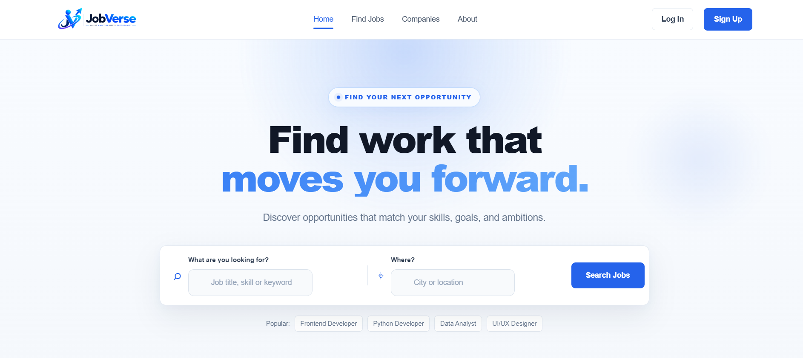
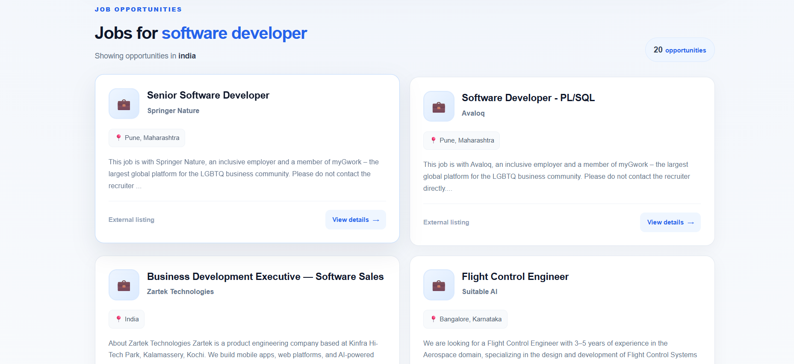
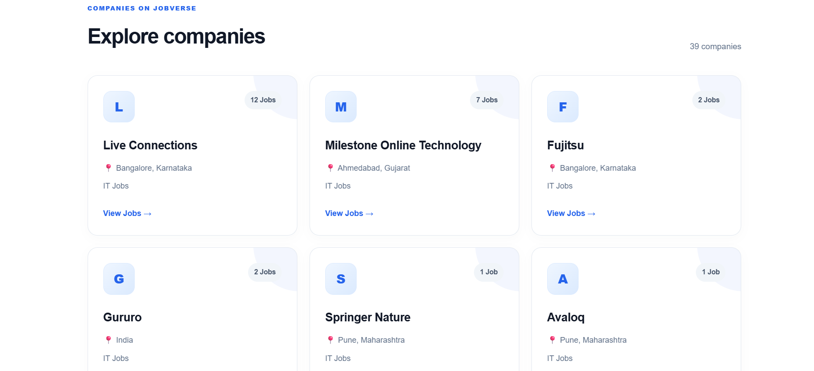
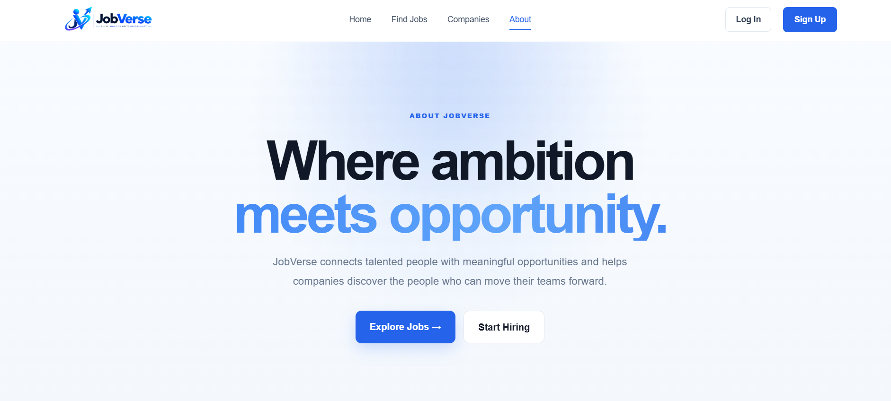

# 🚀 JobVerse

### Where ambition meets opportunity.

JobVerse is a full-stack job discovery and recruitment platform that connects job seekers with employment opportunities and provides recruiters with tools to publish and manage job openings.

The application combines a custom Node.js/Express backend, PostgreSQL database, server-side rendered EJS views, authentication, recruiter workflows, and live job data from an external jobs API.

---

## 📸 Project Preview

### Home

<p align="center">
  
</p>

### Find Jobs

<p align="center">
  
</p>

### Companies

<p align="center">
  
</p>

### About

<p align="center">
  
</p>

---

## ✨ Features

### 👨‍💻 Job Seekers

- Search and explore job opportunities
- View detailed job information
- Search jobs using keywords and locations
- Explore companies and their available jobs
- Create an account and log in
- Apply for job opportunities
- Track applications through the user dashboard

### 🏢 Recruiters

- Recruiter registration and authentication
- Create and manage job postings
- Publish job opportunities
- View posted jobs
- View applicants
- Manage recruitment-related information
- Recruiter dashboard

### 🌐 Platform

- Live job data through external API integration
- Dynamic company discovery
- PostgreSQL database integration
- Session-based authentication
- Role-based functionality
- Working contact form
- Custom 404 error handling
- Responsive and modern UI
- Server-side rendering with EJS

---

## 🛠️ Tech Stack

| Category | Technologies |
|---|---|
| Frontend | HTML5, CSS3, JavaScript |
| Templating | EJS |
| Backend | Node.js, Express.js |
| Database | PostgreSQL |
| Authentication | Express Session, bcrypt |
| API | Adzuna Jobs API |
| Development | VS Code, npm |
| Version Control | Git, GitHub |

---

## 🏗️ Application Architecture

```text
                    ┌──────────────────┐
                    │      User        │
                    └────────┬─────────┘
                             │
                             ▼
                    ┌──────────────────┐
                    │    JobVerse UI   │
                    │   EJS + CSS + JS │
                    └────────┬─────────┘
                             │
                             ▼
                    ┌──────────────────┐
                    │ Express.js       │
                    │ Backend / Routes │
                    └───────┬───┬──────┘
                            │   │
                ┌───────────┘   └────────────┐
                ▼                            ▼
       ┌─────────────────┐          ┌─────────────────┐
       │   PostgreSQL    │          │   Jobs API      │
       │    Database     │          │     Data        │
       └─────────────────┘          └─────────────────┘
```

---

## 🔄 How JobVerse Works

### Job Discovery

```text
User
  ↓
Search / Filter
  ↓
JobVerse Backend
  ↓
External Jobs API
  ↓
Job Results
  ↓
Job Details
```

### Company Discovery

```text
Job Data
   ↓
Extract Company Information
   ↓
Group Companies
   ↓
Count Available Jobs
   ↓
Companies Page
```

### Job Application Flow

```text
Job Seeker
    ↓
View Job
    ↓
Apply
    ↓
Application Stored
    ↓
Job Seeker Dashboard
```

### Recruiter Flow

```text
Recruiter
    ↓
Register / Login
    ↓
Recruiter Dashboard
    ↓
Create Job
    ↓
Publish Job
    ↓
Receive Applications
    ↓
View Applicants
```

---

## 📂 Project Structure

```text
JobVerse/
│
├── controllers/
│
├── middleware/
│   └── config/
│       └── db.js
│
├── routes/
│   ├── authRoutes.js
│   ├── dashboardRoutes.js
│   ├── jobRoutes.js
│   ├── recruiterRoutes.js
│   └── publicRoutes.js
│
├── services/
│   └── jobService.js
│
├── views/
│   ├── home.ejs
│   ├── jobs.ejs
│   ├── jobDetails.ejs
│   ├── companies.ejs
│   ├── about.ejs
│   ├── contact.ejs
│   ├── login.ejs
│   ├── register.ejs
│   ├── apply.ejs
│   ├── jobSeekerDashboard.ejs
│   ├── recruiterDashboard.ejs
│   ├── recruiterApplicants.ejs
│   ├── recruiterJobDetails.ejs
│   ├── postJob.ejs
│   ├── editJob.ejs
│   └── 404.ejs
│
├── public/
│   ├── css/
│   │   └── style.css
│   ├── images/
│   └── js/
│
├── screenshots/
│   ├── about.png
│   ├── companies.png
│   ├── home-page.png
│   └── job.png
│
├── .env.example
├── .gitignore
├── app.js
├── package.json
└── package-lock.json
```

---

## ⚙️ Getting Started

### 1. Clone the repository

```bash
git clone YOUR_REPOSITORY_URL
cd JobVerse
```

### 2. Install dependencies

```bash
npm install
```

### 3. Configure environment variables

Create a `.env` file in the root directory.

```env
DB_USER=your_database_user
DB_PASSWORD=your_database_password
DB_HOST=localhost
DB_PORT=5432
DB_NAME=your_database_name

SESSION_SECRET=your_session_secret

ADZUNA_APP_ID=your_adzuna_app_id
ADZUNA_APP_KEY=your_adzuna_app_key
```

> **Important:** Never commit `.env` to GitHub. Use `.env.example` as a reference.

### 4. Configure PostgreSQL

Create a PostgreSQL database and update the database credentials in your `.env` file.

Make sure PostgreSQL is running before starting the application.

### 5. Start the application

```bash
node app.js
```

The application will be available at:

```text
http://localhost:3000
```

---

## 🔐 Environment Variables

| Variable | Purpose |
|---|---|
| `DB_USER` | PostgreSQL username |
| `DB_PASSWORD` | PostgreSQL password |
| `DB_HOST` | PostgreSQL host |
| `DB_PORT` | PostgreSQL port |
| `DB_NAME` | PostgreSQL database name |
| `SESSION_SECRET` | Secret used to secure user sessions |
| `ADZUNA_APP_ID` | Jobs API application ID |
| `ADZUNA_APP_KEY` | Jobs API application key |

---

## 🗄️ Database

JobVerse uses **PostgreSQL** for persistent application data.

The database supports functionality including:

- User accounts
- Authentication
- Job postings
- Job applications
- Recruiter information
- Contact messages

---

## 🔒 Security

The project follows several basic security practices:

- Passwords are hashed using `bcrypt`
- Sensitive configuration is stored in environment variables
- `.env` is excluded from version control
- Session secrets are not hardcoded
- User roles are checked for protected recruiter functionality
- Uploaded/user-specific files are excluded from the repository

---

## 🎯 What I Learned

Building JobVerse involved working with:

- Node.js and Express.js
- Server-side rendering with EJS
- REST/API integration
- PostgreSQL database operations
- Authentication and sessions
- Password hashing
- Role-based application flows
- CRUD operations
- Dynamic data rendering
- Backend routing
- Form handling
- Responsive frontend development
- Git and GitHub workflow

---

## 🔮 Future Improvements

Possible future improvements include:

- Advanced job filtering
- Saved jobs
- Job recommendations
- Email notifications
- Recruiter analytics
- Candidate search
- Improved application tracking
- Enhanced user profiles
- More advanced search and filtering

---

## 👩‍💻 Author

**Anjali Yadav**

B.Tech — Computer Science & Engineering (AI)

---

## 📄 License

© 2026 Anjali Yadav. All rights reserved.

This project is available for viewing and learning purposes. Unauthorized copying, modification, or redistribution of the source code is not permitted.